# Skills

A collection of **Claude Agent Skills** maintained by Unfold Agency. Each skill packages a repeatable workflow -- instructions, templates, reference material, and helper scripts -- that Claude loads on demand and uses across conversations.

Skills follow the [Agent Skills](https://agentskills.io) open standard, so the same skill folder works in **Claude Code** (the CLI and IDE/desktop coding agent) and in the **Claude apps** (the desktop app and claude.ai).

## What's in this repo

Each top-level directory is one skill. A skill is a folder with a `SKILL.md` at its root, plus any supporting files it needs:

```
<skill-name>/
├── SKILL.md          # required: frontmatter + instructions
├── assets/           # optional: templates, schemas
├── references/       # optional: detailed guidance loaded on demand
├── scripts/          # optional: helper scripts Claude runs via bash
└── workflows/        # optional: deterministic multi-agent orchestration scripts
```

### Naming convention

Name a skill after what it does, with a prefix that signals its kind:

- **`make-<thing>`** -- the skill **produces an output**: a document or artifact you read, review, and sign, not code. `<thing>` is the deliverable. Examples: `make-spec`, `make-arch`, `make-issues`.
- **`do-<thing>`** -- the skill **performs an action**: writing code, manipulating files, driving a process that changes the repo or the world. `<thing>` is the work. Example: `do-work`.

The test is output vs. action: if the skill hands back an artifact, it is `make-`; if it changes the codebase, it is `do-`. The folder name, the `name` field in `SKILL.md`, and the slash command all share the name, so `make-spec/` is invoked as `/make-spec` and `do-work/` as `/do-work`.

- Lowercase letters, numbers, and hyphens only (the same characters the `name` field allows).
- Keep `<thing>` short and concrete -- the artifact for `make-` (`make-spec`, `make-arch`), the work for `do-` (`do-work`) -- not a vague activity (`spec-author`) or a bare verb (`generate`).
- The `# Heading` inside a `SKILL.md` is a readable form of the same imperative -- `# Make a spec`, `# Do work`. Only the machine `name`/folder must match the prefix form exactly.

If you know the output or the action, you know the command.

**One documented exception:** `summon-council` is a deliberation engine -- it neither hands back a build artifact nor changes the codebase, so it fits neither prefix. Its verb-noun name (invoked `/summon-council`) is intentional; the convention holds for every other skill.

### The pipeline skills

These four chain end to end -- see [How these skills chain](#how-these-skills-chain).

| Skill | What it does |
|---|---|
| [`make-spec`](./make-spec) | Turns discovery material into a layered spec set under `docs/product/`: a lean `overview` (problem, users, goals `G-NNN`, scope, a `feature_index`) plus one WHAT-only `features/<slug>` file per feature, each with EARS acceptance criteria, pinned requirement IDs (`FR`/`IR`/`NFR`/`CR`), and per-requirement **`verification`** entries (how each will be proven -- method + check, a negative-path entry mandated per FR). A fail-closed fingerprint gate detects and blocks internal drift, and an `origin/main` no-vanishing check stops accidental deletions. |
| [`make-arch`](./make-arch) | Derives the architecture from the spec set: an `architecture.md` (C4 / arc42-lite with mermaid) plus an append-only ADR log under `docs/product/decisions/`. Recommend-then-refine, with each decision typed by confidence (`known` vs `assumption`). |
| [`make-issues`](./make-issues) | Projects the spec set (overview + features + ADRs) into traceable GitHub Issues **just-in-time**: pick the features/requirements to ticket (a checklist, a description, or `--feature`/`--req`/`--all`), create them, and reconcile them as the specs change. Writes are scoped but drift detection stays **global**, so a scoped run never mass-closes what it did not select. Requires a spec set (it stops and points you to `/make-spec` if none exists); on-demand `amendment` issues anchor to a feature/goal/ADR when the work is not yet a requirement. Per-requirement item fingerprints, a scoped spec-integrity preflight, a bounded reconcile engine, issue meta stamping `provenance` / `trace_req` / `trace_adr` / `feature` / `source_version`, and a dedicated `ISSUES-CHANGELOG.md` ledger. |
| [`do-work`](./do-work) | Builds the project from those GitHub Issues, one actionable issue per run by default (drain the whole backlog with `--no-limit`, cap at N with `--limit=<N>`, preview the plan and approve before building with `--dry-run`, scope to one implementation phase with `--phase=<N>`, target one ticket with `--issue=<N>`, get a morning-after status with `--status`, or go fully autonomous with `--dangerously`), implements each issue on a branch, runs the build gate, opens a PR that closes it, then **reviews and fixes that PR** (via `do-pr-review` / `do-pr-fix`) and applies a **terminal acceptance gate** before optionally merging (`--auto-merge`). Respects AFK/HITL autonomy and the dependency order, and escalates a blocked build back upstream instead of editing scope. |

### The traceability companion

A `make-` skill that produces an observability artifact over the whole pipeline rather than a lane that feeds downstream. It runs after `make-issues` (and after `do-work` changes issue state), or on demand:

| Skill | What it does |
|---|---|
| [`make-trace`](./make-trace) | Renders a single self-contained traceability map -- Objectives (`G-NNN`) -> Requirements (`FR`/`IR`/`NFR`/`CR`) -> Architecture (components / integrations / ADRs) -> GitHub Issues -- with every edge **derived from the specs + issue meta** (no hand-mapping) and a **live roll-up** coloring each parent by the status of the issues beneath it. The map is **additive**: it accumulates a ledger and **tombstones** anything deleted (an issue or requirement that disappears is shown struck-through as `deleted`, never dropped), while adds, edits, and renumbers flow through normally. Output is a private, self-contained `docs/product/traceability/index.html` opened locally (nothing is published, no GitHub Action); a byte-identical no-op guard means an unchanged map produces no diff. Flags: `--repo`, `--spec-dir`, `--out`, `--allow-empty`, `--open`. |

### The feature-level engineering aids

Two more `make-` companions that sit after `make-arch`. They are **advisory** -- like `make-trace`, they refresh engineering artifacts and never gate `make-issues`/`do-work`, and each keeps its own fail-closed fingerprint + byte-identical no-op guards so it never self-corrupts. Run them on demand, targetable per-feature:

| Skill | What it does |
|---|---|
| [`make-data-flows`](./make-data-flows) | Generates and maintains per-feature **data-flow and user-flow diagrams** (Mermaid) embedded in each `features/<slug>.md` **body**, so an engineer can see how one feature moves data and walks a user. Because the diagrams live in the body they are **out of make-spec's fingerprint** (which hashes only the frontmatter), so embedding never moves a feature version or trips the S-006 gate. It fans out one worker sub-agent per feature, uses the stamped `feature_version` as the SKIP-vs-REGENERATE oracle (an advisory edit never regenerates), preserves the human narrative byte-for-byte, and is byte-identical on a no-op. `--feature`, `--all`, `--check`, `--force`. |
| [`make-api-contracts`](./make-api-contracts) | Derives a **mock-ready OpenAPI 3.1 contract** for the project's OWN API surface from the requirements (`interface` sketches + `IR-*`), the `make-data-flows` diagrams, and the governing ADRs -- `docs/product/api/openapi.yaml` (a mock server ingests it directly: `prism mock ...`) plus a generated `API-CONTRACTS.md` index. Each operation is stamped with provenance (`x-trace-req` / `x-feature` / `x-source-version` / `x-trace-adr` / `x-integration`) and updated by **upsert-by-operationId** (human-owned `summary`/`description`/`x-notes` preserved), with additive **tombstoning** and a byte-identical no-op. External providers (Stripe, ...) are referenced via ADR/integration, never redefined. `--feature`, `--all`, `--check`, `--allow-empty`. |

### Utility skills

Standalone skills that run on their own rather than as a lane in the planning-and-build chain. Most are `do-` skills that perform actions, like the pipeline's `do-work`; `summon-council` is the deliberation exception noted above:

| Skill | What it does |
|---|---|
| [`do-git-workflow`](./do-git-workflow) | Enforces a branch-first Git workflow -- `type/short-description` branches, Conventional Commits with GitMoji prefixes, and pull requests opened via the `gh` CLI (ready for review by default; draft only mid-work). |
| [`do-git-prune`](./do-git-prune) | Deletes local branches fully merged into the default branch -- ancestor-merged (`-d`) and squash/rebase content-merged via a merged PR (`-D`) -- by dispatching a Haiku sub-agent. Never touches the default branch, the current branch, or open-PR heads. `--dry-run` previews, `--remote` also deletes merged remote branches. |
| [`do-pr-review`](./do-pr-review) | Reviews a GitHub PR diff, posts inline review comments, validates or rejects existing comments in-thread, and submits a verdict. Comment-only -- never edits code. Also runs as the review step inside `do-work`'s drain. |
| [`do-pr-fix`](./do-pr-fix) | Implements the requested changes on a reviewed PR, replies in-thread explaining each fix, runs tests/build, and pushes the commits -- the back-half of the review loop and companion to `do-pr-review`. Also runs as the fix step inside `do-work`'s drain. |
| [`do-pr-merge`](./do-pr-merge) | Merges an open PR by dispatching a Haiku sub-agent that runs the merge and (by default) deletes the head branch. Method defaults to the repo's configured strategy (linear-preferred); `--squash`/`--merge`/`--rebase` override, `--no-delete` keeps the branch. Merge-only -- never reviews or edits code, and respects branch protection (no `--admin` bypass). |
| [`summon-council`](./summon-council) | Convenes a tiered council of opposing voices to pressure-test a high-stakes decision (path selection, go/no-go, artifact review, security review): an always-seated **core trio** (Harbinger, Adversary, Zealot), a **premise gate** (the Oracle, always run), and a **bench** of specialists summoned only when the decision touches their domain. The Chair dispatches **each seat as an isolated sub-agent** so positions are collected blind, then runs an anonymized cross-examination and synthesizes a verdict, leaving an ADR-compatible record. Neither `make-` nor `do-` (above). |

Skills load progressively: only the frontmatter `description` sits in context at all times; the `SKILL.md` body loads when the skill is triggered, and supporting files load only when referenced. Keep that in mind when adding to a skill -- bundled reference files are effectively free until used.

### How these skills chain

These four skills form a pipeline -- three `make-` lanes that produce the planning artifacts, then `do-work` to build from them. Each consumes what the lane upstream produced, and a **fail-closed fingerprint gate** at every hop keeps them honest.

```
discovery ──/make-spec──▶  overview + per-feature specs  ──/make-arch──▶  architecture + ADRs
            (WHAT, per feature)                                          (HOW, as decisions)
                                                                              │
                                                                       /make-issues
                                                                              ▼
                                                              GitHub Issues  ──/do-work──▶  merged PRs
                                                              (work items)                 (shipped code)
```

The map below is the same chain in full, top to bottom -- every optional path, human-review gate, and loop-back, as it actually runs:

```mermaid
flowchart TD

%% ── styling ──────────────────────────────────────────────
classDef skill fill:#E4DAF9,stroke:#7C5CBF,stroke-width:2px,color:#2E1065
classDef human fill:#FDE0DC,stroke:#D65745,stroke-width:2px,color:#7C1D0E
classDef artifact fill:#FFFFFF,stroke:#9CA3AF,stroke-width:1.5px,color:#1F2937
classDef gate fill:#FEF3C7,stroke:#D97706,stroke-width:1.5px,color:#78350F
classDef advisory fill:#DBEAFE,stroke:#3B82F6,stroke-width:1.5px,color:#1E3A8A
classDef step fill:#F3F4F6,stroke:#6B7280,stroke-width:1.5px,color:#111827
classDef input fill:#EAF7EA,stroke:#4C9A52,stroke-width:1.5px,color:#14532D
classDef done fill:#DCFCE7,stroke:#16A34A,stroke-width:2px,color:#14532D
classDef change fill:#FCE7F3,stroke:#DB2777,stroke-width:2px,color:#831843

%% ── inputs ───────────────────────────────────────────────
DISC["📥 Discovery material<br/>RFPs · briefs · workshops · meeting notes"]:::input
REPO["Create the GitHub repo"]:::step
DISC --> REPO --> MS

%% ── 1 · specify ──────────────────────────────────────────
subgraph S1["1 · Specify — the WHAT"]
    MS["/make-spec"]:::skill
    SPECS["docs/product/ spec set<br/>overview.md + features/&lt;slug&gt;.md<br/>EARS criteria · pinned FR/IR/NFR/CR IDs ·<br/>verification entries · fingerprints"]:::artifact
    HR1["👤 HUMAN REVIEW<br/>read and sign the spec set —<br/>an approved version is frozen-at-signature"]:::human
    MS --> SPECS --> HR1
end
HR1 -. "revise scope or wording" .-> MS

%% ── 2 · architect ────────────────────────────────────────
subgraph S2["2 · Architect — the HOW"]
    MA["/make-arch<br/>recommend-then-refine"]:::skill
    ARCH["architecture.md + decisions/ADR-*.md<br/>C4 / arc42-lite · append-only ADR log"]:::artifact
    HR2["👤 HUMAN REVIEW<br/>confirm each decision —<br/>typed known vs assumption"]:::human
    MA --> ARCH --> HR2
end
HR1 -->|"approved"| MA
HR2 -. "refine or supersede an ADR" .-> MA

%% ── optional advisory companions ─────────────────────────
subgraph SADV["Optional · advisory — never gates the build"]
    MDF["/make-data-flows<br/>per-feature data + user flows,<br/>embedded in feature bodies"]:::advisory
    MAC["/make-api-contracts<br/>mock-ready api/openapi.yaml<br/>+ API-CONTRACTS.md"]:::advisory
    MDF --> MAC
end
HR2 -. "on demand, per feature" .-> MDF

%% ── 3 · ticket ───────────────────────────────────────────
subgraph S3["3 · Ticket"]
    MI["/make-issues — just-in-time<br/>scope: checklist · description ·<br/>--feature · --req · --all"]:::skill
    PRE["⛔ Integrity preflight — fail-closed<br/>fingerprint gate (drift detection stays global) ·<br/>origin/main no-vanishing check"]:::gate
    ISS["GitHub Issues<br/>stamped: provenance · trace_req · trace_adr ·<br/>feature · source_version · AFK / HITL"]:::artifact
    AMEND["amendment issue — work not yet a<br/>requirement, anchored to a feature / goal / ADR"]:::artifact
    HR3["👤 HUMAN REVIEW (optional)<br/>triage the backlog · adjust AFK vs HITL"]:::human
    MI --> PRE -->|"specs clean"| ISS --> HR3
    MI -->|"on demand"| AMEND
end
HR2 -->|"approved"| MI
PRE -. "no spec set, or a selected spec is dirty →<br/>blocked, fix upstream" .-> MS
AMEND -. "promoted in place once /make-spec<br/>adds the requirement" .-> MS
ISS -. "spec or ADR changed → re-run:<br/>updates unstarted issues, flags in-flight ones" .-> MI

%% ── 4 · build ────────────────────────────────────────────
subgraph S4["4 · Build — the do-work loop"]
    DW["/do-work<br/>one AFK issue by default · --no-limit · --limit=N ·<br/>--phase=N · --issue=N · --status · --dangerously"]:::skill
    DRY["👤 --dry-run (optional)<br/>outline the plan, wait for approval"]:::human
    SEL["select the next actionable issue<br/>dependency order · AFK only (HITL waits for a human<br/>unless --dangerously) · flagged-stale issues refused"]:::step
    BLD["build on a branch → open a PR<br/>+ as-built ledger: met / deferred / mocked<br/>per acceptance criterion"]:::step
    PRR["/do-pr-review<br/>independent reviewer<br/>(bot identity via GH_REVIEW_TOKEN)"]:::skill
    FIND{"Critical / Major<br/>findings?"}:::step
    FIX["/do-pr-fix<br/>implement findings · reply in-thread · push"]:::skill
    ACC["⛔ Acceptance gate<br/>every criterion met?"]:::gate
    ESC1["👤 parked for a human<br/>label: escalated"]:::human
    ESC2["👤 parked for a human — needs-human-review<br/>(under --dangerously: merged anyway,<br/>each gap filed as a follow-up issue)"]:::human
    MRG{"merge"}:::step
    HMG["👤 human merges (default)<br/>e.g. /do-pr-merge"]:::human
    AMG["auto-merge on green CI<br/>(--auto-merge / --dangerously)"]:::step
    DONE["✅ PR merged → issue closed →<br/>dependents unblocked"]:::done

    DW -->|"--dry-run"| DRY -->|"plan approved"| SEL
    DW --> SEL
    SEL --> BLD --> PRR --> FIND
    FIND -->|"yes"| FIX --> PRR
    FIND -->|"no — review-clean"| ACC
    FIND -->|"won't converge (~2 rounds)"| ESC1
    ACC -->|"all met"| MRG
    ACC -->|"any deferred / mocked"| ESC2
    MRG --> HMG --> DONE
    MRG --> AMG --> DONE
    DONE -->|"next issue<br/>(--no-limit / --limit=N)"| SEL
end
HR3 --> DW
BLD -. "design gap →<br/>add or supersede an ADR" .-> MA
BLD -. "wrong or unsatisfiable requirement →<br/>amend the feature" .-> MS

%% ── change loop ──────────────────────────────────────────
CHG["🔁 Change arrives<br/>new requirement · feature amended · scope shift<br/>(change flows forward only — never edit scope in an issue)"]:::change
CHG -. "amend" .-> MS

%% ── observability ────────────────────────────────────────
TRC["/make-trace<br/>goals → requirements → architecture → issues<br/>live roll-up · additive, tombstones ·<br/>docs/product/traceability/index.html (private)"]:::advisory
ISS -. "refreshed after every run" .-> TRC
DONE -. "refreshed after every run" .-> TRC
```



**Reading the map.** Purple nodes are the skills you invoke; red 👤 nodes are where a human reviews or decides; yellow ⛔ nodes are the enforced fail-closed gates (machine-checked, not assumed); blue nodes are the advisory companions (regenerated on demand, never gating the build); green is shipped work; dashed edges are optional paths and loop-backs.

- **`/make-spec`** turns discovery material into the spec set under `docs/product/`: a lean `overview` (problem, users, goals `G-NNN`, scope, a `feature_index`) and one WHAT-only `features/<slug>` file per feature, each with EARS acceptance criteria and pinned requirement IDs (`FR`/`IR`/`NFR`/`CR`). Every spec carries a stored fingerprint.
- **`/make-arch`** derives the HOW from the spec set: an `architecture.md` plus an append-only ADR log in `docs/product/decisions/`, each decision typed `known` or `assumption`.
- **`/make-issues`** projects requirements and ADRs into issues **just-in-time** -- scope the run to the features/requirements you pick (a checklist, a description, or `--feature`/`--req`/`--all`); writes are scoped but drift detection stays global, so it never mass-closes an unselected feature. Each issue is stamped with its `provenance`, `trace_req`, `trace_adr`, `feature`, and `source_version` plus a per-requirement fingerprint; on-demand `amendment` issues anchor to a feature/goal/ADR (a "quick amendment, not a rewrite"), promoted in place once `/make-spec` adds the requirement. It requires a spec set (it stops and points upstream if none exists) and records every run in a dedicated `docs/product/ISSUES-CHANGELOG.md`.
- **`/do-work`** claims each actionable issue, builds the slice, opens a PR that closes it, reviews and fixes the PR, and applies the terminal acceptance gate -- respecting the issue's AFK/HITL flag and its dependency order. It trusts `make-issues` for drift (it does not recompute fingerprints) and refuses any issue `make-issues` has flagged stale.
- **`/make-trace`** sits alongside the chain rather than inside it: it visualizes traceability across all four tiers -- goals -> requirements -> architecture -> issues -- with a live roll-up derived from the specs and each issue's meta block. It is refreshed at the end of every `/make-issues` and `/do-work` run (and on demand), so the map keeps pace with the backlog without any bot committing to the repo.

**Loop-back.** Change flows forward only. Amend a feature with `/make-spec` → re-run `/make-arch` if a decision is affected → re-run `/make-issues` to reconcile → `/do-work` resumes building. You never edit scope inside an issue or skip a lane: each skill diffs rather than rewrites, preserves IDs, and reports what downstream work the change owes. When a build hits a wall, `/do-work` escalates *back* up the same chain -- a design gap to `/make-arch` (add or supersede an ADR), a wrong or unsatisfiable requirement to `/make-spec` (amend the feature) -- rather than coding around it.

**The integrity gate (enforced, not assumed).** The pipeline does not claim drift is impossible -- it claims drift is **detected and blocked**. Each spec stores a fingerprint of its own content; `make-issues`' preflight recomputes every fingerprint and **fails closed** when a spec it is about to build from is dirty -- on a full run that is any spec, and on a scoped run it is any *selected* feature (a dirty *unselected* feature only warns, since the run will not touch it). Detection is always global even when writes are scoped, so nothing drifts silently. A separate `origin/main` **no-vanishing check** blocks a run that would silently drop a previously-shipped requirement or feature. The gate detects and blocks internal drift; it does not pretend the specs can never move. And it certifies exactly one thing -- **these bytes have not changed since they were stamped** -- not that the content is correct, that a human re-read it, or who authored it (git carries authorship; correctness is the verification layer's job).

**The documentation model (rule + regime).** Two properties place every artifact the pipeline touches. The **rule** decides who writes it: hand-write what cannot be derived (intent -- why, decisions, requirements); machine-generate what can be (state -- status, traceability, contracts); and machine-check the seam between them. The **regime** decides how it changes: **live** (the specs -- edited in place, re-stamped, diffed forward), **append-only** (ADRs and the CHANGELOGs -- never edited, only added to or superseded), **regenerated** (the trace map, flow diagrams, OpenAPI contract -- byte-identical no-op, never hand-touched), and **frozen-at-signature** (an `approved` spec version -- the commitment a client signs; it changes only by a new amend + re-approval, and its `verification` entries are the test of that promise). Rot happens when content sits in the wrong cell -- hand-written state drifts, generated intent is vacuous -- so each skill states which cell its artifacts live in.

**Where the artifacts live.** In a project repo everything the pipeline reads and writes has **one managed root -- `docs/product/`**. That single path prefix is the ownership contract: the skills never touch anything under `docs/` outside it, so the rest of `docs/` is free for whatever else the team keeps (engineering notes, onboarding, client material) without ever interfering with the workflow. **Git history is the archive** -- there is no separate archive folder; each prior version is simply the commit that wrote it.

```
docs/
├─ product/                                      # THE PIPELINE'S MANAGED ROOT
│  ├─ overview.md                                #   problem, users, goals, scope, feature_index
│  ├─ features/
│  │  └─ <slug>.md                               #   one WHAT-only spec per feature (EARS + verification, pinned IDs)
│  ├─ architecture.md                            #   the HOW (frontmatter contract + C4 narrative/mermaid)
│  ├─ decisions/
│  │  └─ ADR-0001-<slug>.md                      #   append-only ADR log
│  ├─ api/
│  │  └─ openapi.yaml + API-CONTRACTS.md         #   mock-ready contract (make-api-contracts)
│  ├─ traceability/
│  │  └─ index.html                              #   the generated trace map (make-trace)
│  ├─ CHANGELOG.md                               #   spec deltas (make-spec)
│  └─ ISSUES-CHANGELOG.md                        #   issue-ops ledger (make-issues)
└─ <anything else>                               # yours -- never read or written by the pipeline
```

Migrating a project from the previous layout is one move -- `git mv docs/specs docs/product` (plus `git mv docs/traceability docs/product/traceability` if present); fingerprints are content hashes, so nothing needs re-stamping, and every script prints a migration hint when it finds the legacy layout.

The spec docs (`overview.md`, `features/<slug>.md`) are **single Markdown files**: the YAML **frontmatter** is the machine-readable contract the downstream skills consume and the fingerprint signs, and the body is human narrative -- the bytes a human reviews and signs are the bytes the pipeline builds from (no separately-derived data file). The architecture layer follows the same discipline: `architecture.md`'s frontmatter carries its machine contract, and each `decisions/ADR-*.md` file's frontmatter is its own record (the derived `arch-data.yaml` is retired; `make-arch`'s `migrate_arch_data.py` converts a legacy project in one command). `make-issues` and `do-work` read `docs/product/` by default. A version bump is a commit, not a snapshot folder -- to see a prior version, read the spec at that commit.

**One thread, end to end:**

| Lane | Artifact | IDs |
|---|---|---|
| Spec | "Customers can check out" -- a feature spec with an EARS functional requirement under it | `G-001`, `FR-CHK-001` |
| Arch | The ADR that governs how checkout is built (the Shopify order-create integration) | `ADR-0001` |
| Issues | "Build the Shopify order-create call" -- meta block stamps `trace_req: [FR-CHK-001]`, `trace_adr: [ADR-0001]`, `feature: checkout`, `source_version: <feature_version>` | issue #N |
| Build | A branch + PR implementing issue #N that `Closes #N`; the merge closes it COMPLETED and unblocks its dependents | PR, branch `feat/issue-N-order-create` |

Change `FR-CHK-001`'s acceptance criteria with `/make-spec` and re-run `/make-issues`: the per-requirement fingerprint changes, so issue #N is updated (if unstarted) or flagged (if in flight) -- and the engineer's notes in the issue's human region are never touched.

### The build loop: build → review → fix → acceptance gate → merge

`do-work` doesn't just open a PR and stop. It **builds one actionable issue by default** (a bounded, observable run; `--no-limit` drains the whole backlog, `--limit=<N>` caps at N), and every PR it opens runs through an automatic **review → fix loop** and then a **terminal acceptance gate** before the run is done with it:

```
select next issue
   │
   ▼
build  ──▶  PR opened (+ an as-built ledger: met / deferred / mocked per criterion)
   │
   ▼
review  ──▶  fix  ──▶  re-review  ──▶ … (until no Critical/Major findings, max ~2 rounds)
   │                                         │
   │ can't converge after N rounds           │ review-clean
   ▼                                         ▼
park for a human (label `escalated`)     acceptance gate (every criterion met?)
                                              │                         │
                       any deferred/mocked, or no ledger         all met
                                              ▼                         ▼
                            park for a human (needs-human-review)   merge (only with --auto-merge)
```

- **Review** is `do-pr-review` (posts inline findings; comment-only in the same-identity fallback). **Fix** is `do-pr-fix` (addresses the findings, replies in-thread, pushes). The review is **context-independent** -- the reviewer is a fresh worker that never shares the builder's context. Set **`GH_REVIEW_TOKEN`** and that reviewer authenticates as a bot, so it can post a real `REQUEST_CHANGES` and GitHub's native review state carries the signal -- a genuine independent second set of eyes; without the token it falls back to the structured `blocking_open` gate (same review, shared gh identity).
- **The acceptance gate (consistency != correctness).** The fingerprint gates prove the specs, issues, and build are mutually *consistent*; they do not prove the code actually *satisfies* the acceptance criteria. So each worker returns an **as-built ledger** -- one entry per acceptance criterion, `met` / `deferred` / `mocked`, with evidence -- and the orchestrator treats an issue as done only when every criterion is `met`. Any `deferred`/`mocked` entry parks the PR for a human (under `--dangerously` it may still merge on green CI, but each gap gets a `needs-human-review` follow-up -- the ledger is the debt record). It **records and gates on** what was met; it does not claim to prove correctness.
- **Merge stays manual** unless you pass `--auto-merge`; a merge closes the issue and unblocks its dependents, which is what lets a full dependency chain drain in one pass.
- A PR the loop can't get clean -- or that isn't acceptance-clean -- is **left open and labelled** for a human, never merged.

Each lane of the loop runs on the **model that fits the task** -- build and review get the strongest model (build quality is upstream of everything; bug-finding is where the top model earns its cost), fix is bounded so it runs mid-tier, and the mechanical steps run on the cheapest tier. Every default is overridable per run.

| Stage | Default model | Why |
|---|---|---|
| Build (`do-work`) | **Opus** | The quality-upstream step -- a weak build becomes review/fix churn. |
| Review (`do-pr-review`) | **Opus** | The adversarial gate -- a cheaper reviewer misses real bugs. |
| Fix (`do-pr-fix`) | **Sonnet** | Bounded: the reviewer hands it a findings list to implement. |
| Preflight / Select / Escalate / Merge | **Haiku** | Run a script or a few `gh` calls -- the cheapest tier is plenty. |

This whole loop is encoded deterministically in `do-work/workflows/drain-queue.js`, run via the Workflow tool:

```js
Workflow({ scriptPath: "<do-work>/workflows/drain-queue.js",
           args: { repo: "owner/name", skillDir: "<do-work>",
                   autoMerge: true, noLimit: true, parallel: 2,  // omit noLimit -> one issue
                   reviewToken: process.env.GH_REVIEW_TOKEN,  // bot review identity (optional)
                   modelBuild: "opus", modelFix: "sonnet", effortReview: "high" } })
```

The script locates `do-pr-review` and `do-pr-fix` as siblings of `skillDir` automatically, and honors `reviewToken` (or env `GH_REVIEW_TOKEN`) for the bot review identity. For the full mechanics -- the worker brief, the review / acceptance / merge gate, the bot-review-identity path and its fallback, and resuming a killed run -- see [`do-work/SKILL.md`](./do-work/SKILL.md) and [`do-work/references/execution-loop.md`](./do-work/references/execution-loop.md).

### Driving do-work: flags and modes

Invoke `do-work` as `/do-work [flags]` (or headless: `claude -p "/do-work [flags]"`). With no flags it builds the next single **AFK** issue and leaves the clean PR ready for a human to merge. The flags compose:

| Flag | What it does |
|---|---|
| *(none)* | Build the next single actionable **AFK** issue: build → review → fix the PR, apply the acceptance gate, then stop. The clean PR is left **ready-for-review**; a human merges. A bare run is bounded -- one issue -- so nothing runs away before you look. |
| `--no-limit` | Drain every actionable **AFK** issue: re-select after each until the queue is dry or only HITL / blocked work remains (the old default). Pair with `--auto-merge` to drain a full dependency chain in one pass. |
| `--limit=<N>` | Cap the run at N issues (the default is `--limit=1`; `--limit=0` is the same as `--no-limit`). |
| `--dry-run` | Outline **what it plans to do** -- a per-issue build outline for each in-scope issue -- and **wait for approval** before building anything. Composes with the scope flags and with `--auto-merge` / `--dangerously`. Interactive `/do-work` only. |
| `--phase=<N>` | Drain only issues in **implementation phase N** -- the GitHub milestone `Phase N: …` that `make-issues` creates from the overview's optional `phasing` block. Composes with `--limit`. |
| `--issue=<N>` | Build exactly issue **#N**, then stop. Bypasses the phase/autonomy filters (you picked it explicitly), but still skips a flagged, blocked, or in-flight target. Takes precedence over `--phase`. |
| `--auto-merge` | After a PR's review loop is clean, it is acceptance-clean, and CI is green, merge it -- closing the issue and unblocking its dependents -- then continue. The full overnight loop. |
| `--status` | Report and exit; build nothing. Prints the **morning-after surface** -- what merged, what is parked for a human, what is dangling (a branch/PR left open, not yours), what is safe to resume, and what is ready to build next. Run it first thing after an overnight or `--dangerously` run. |
| `--dangerously` | **Full autonomy, accept the risk.** Build **and merge** issues (AFK **and** HITL) with no human prompts -- one issue by default; add `--no-limit` to power through the whole backlog. See below. |

**`--phase` and the implementation plan.** A project's `overview` (from `/make-spec`) can carry a `phasing` block (e.g. *Phase 1: Foundation*, *Phase 2: Checkout*). `/make-issues` turns each phase into a GitHub **milestone** and files every issue under its phase. `/do-work --phase=1` then builds only that phase's issues -- so you can ship the foundation, review it, and only then drain phase 2. The dependency gate still applies: a phase-2 issue blocked by an unmerged phase-1 issue waits, so a clean phase-by-phase drive usually pairs `--phase` with `--auto-merge`.

**`--dangerously` -- maximum throughput, you own the risk.** It builds and merges without stopping for input -- one issue by default, or **every** buildable issue (AFK and HITL alike) when paired with `--no-limit`:

- It **builds and merges HITL** issues like any other (the one mode where the HITL gate is lifted).
- For an **implementation** gap it **resolves** with a best-practice default and **mocks** any missing external (an API, seed data, a credential) so work keeps moving -- **but an unsatisfiable acceptance criterion is a spec defect, not an implementation choice, and it ALWAYS escalates and stops that issue**, even here.
- It **merges on green CI even with unresolved review findings, or with deferred/mocked acceptance criteria** -- a red CI is never merged; it is flagged and left open.
- Everything it decided on its own -- assumptions, mocks, unmet acceptance criteria, unconverged findings -- is opened as a **`needs-human-review` follow-up issue** for a human to triage afterward.

It still **skips** issues `make-issues` flagged stale (the spec is known out of date), and it never edits the specs or an issue's scope -- it resolves *implementation* ambiguity and mocks *missing externals* only. Use it solely when a human will work the follow-up queue after the run.

**Examples**

```bash
/do-work                          # build just the next AFK issue; a human merges
/do-work --dry-run                # outline the next issue's plan, then wait for approval
/do-work --no-limit               # drain the whole AFK queue; humans merge
/do-work --phase=1 --auto-merge   # ship implementation phase 1 end to end
/do-work --issue=42               # build one specific issue
/do-work --no-limit --auto-merge  # overnight loop: build, review, fix, gate, merge the backlog
/do-work --status                 # morning-after surface: what merged / parked / resumable
/do-work --no-limit --dangerously # full autonomy over the whole backlog
```

The same loop runs deterministically via the drain workflow (above) for long backlogs -- pass `noLimit: true` (or `limit: <N>`), `phase`, `issue`, or `dangerously: true` as args alongside `repo` and `skillDir`. The workflow builds one issue by default too; there is no `dryRun` arg (that gate is interactive-only).

## Use these skills in Claude Code

Claude Code discovers skills from the filesystem -- no upload step. Skills live in one of two places:

| Scope | Path | Available in |
|---|---|---|
| Personal | `~/.claude/skills/<skill-name>/SKILL.md` | all your projects |
| Project | `<repo>/.claude/skills/<skill-name>/SKILL.md` | that project only |

### Install

Clone this repo, then **copy** or **symlink** the skill folders you want into your skills directory.

```bash
git clone git@github.com:Unfold-Agency/skills.git
cd skills

# Ensure the personal skills directory exists:
mkdir -p ~/.claude/skills

# Personal, available everywhere -- copy into the skills directory:
cp -R make-spec ~/.claude/skills/

# ...or symlink, so repo edits are picked up live (use an absolute path):
ln -s "$(pwd)/make-spec" ~/.claude/skills/
```

To make a skill available only inside a specific project, copy it into that project's `.claude/skills/` instead:

```bash
mkdir -p /path/to/your-project/.claude/skills
cp -R make-spec /path/to/your-project/.claude/skills/
```

### Invoke

- **Directly:** type `/<skill-name>` (for example `/make-spec`).
- **Automatically:** Claude triggers a skill on its own when your request matches the skill's `description`.

### Update

```bash
cd skills
git pull
```

- **Symlinked** skills are updated by the `git pull` alone.
- **Copied** skills need to be re-copied after pulling: `cp -R make-spec ~/.claude/skills/`.

For sharing across a team or distributing many skills at once, skills can also be packaged and installed as a [Claude Code plugin](https://code.claude.com/docs/en/plugins) instead of copied by hand.

## Use these skills in the Claude apps (desktop and claude.ai)

The Claude desktop app and claude.ai use the same custom-skill feature. Skills are **uploaded as zip files** rather than read from the filesystem.

**Requirements:** a Pro, Max, Team, or Enterprise plan with code execution enabled (under **Settings → Features**). Custom skills are not available on the Free plan.

### Install

1. From this repo's root, zip the skill's folder (the zip must contain the folder with its `SKILL.md`):
   ```bash
   zip -r make-spec.zip make-spec
   ```
2. In the Claude app, open **Settings → Features**.
3. Under **Skills**, upload `make-spec.zip`.

Claude uses the skill automatically when a request matches its description. The upload takes effect in new conversations.

### Update

Re-zip the folder after pulling the latest changes, then replace the existing skill in **Settings → Features** (delete the old one and upload the new zip).

> **Note:** custom skills do **not** sync across surfaces. A skill uploaded to claude.ai is not available in Claude Code or via the API, and vice versa -- each surface is managed separately. On claude.ai, custom skills are per-user and are not shared organization-wide.

## SKILL.md requirements

Every skill needs a `SKILL.md` whose YAML frontmatter declares, at minimum, `name` and `description`:

```yaml
---
name: make-spec
description: Turn discovery material into a layered spec set. Use when the user wants to capture requirements, write the per-feature specs, or amend an existing spec.
---

# Make a spec

Instructions for Claude go here...
```

- **`name`** -- lowercase letters, numbers, and hyphens only; max 64 characters; cannot contain the words "claude" or "anthropic". Defaults to the directory name.
- **`description`** -- non-empty, max 1024 characters. State both **what** the skill does and **when** Claude should use it; this is all Claude sees when deciding whether to trigger the skill, so make it specific.

Claude Code supports additional optional frontmatter (invocation control, subagent execution, dynamic context). See the references below.

## Contributing

- One skill per top-level directory; keep `SKILL.md` lean and push long material into `references/`.
- Branch off `main` (`type/short-description`), use Conventional Commits, and open a pull request -- do not commit directly to `main`.
- Only install skills from sources you trust: a skill can direct Claude to run code and use tools, so review `SKILL.md`, scripts, and other bundled files before use.

## References

- [Use Skills in Claude Code](https://code.claude.com/docs/en/skills)
- [Agent Skills overview](https://platform.claude.com/docs/en/agents-and-tools/agent-skills/overview)
- [Creating custom Skills (Claude Help Center)](https://support.claude.com/en/articles/12512198-creating-custom-skills)
- [Claude Code plugins](https://code.claude.com/docs/en/plugins)
- [Agent Skills open standard](https://agentskills.io)
