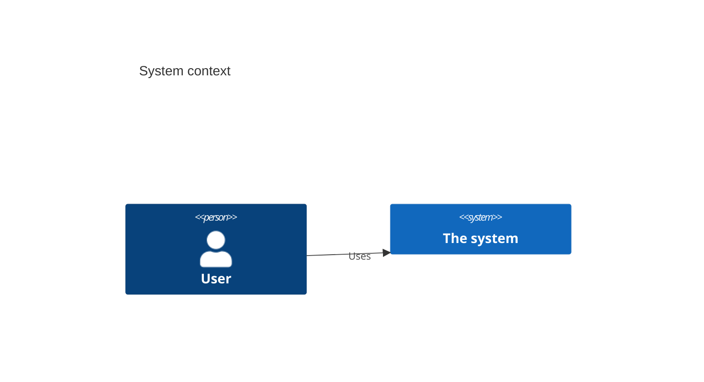

<!--
═══════════════════════════════════════════════════════════════════
ARCHITECTURE TEMPLATE -- docs/product/architecture.md   (make-arch)

A thin C4/arc42-lite overview of HOW the system is built: the stack, the
components, the external integrations, and the diagrams that make it
legible. It is deliberately SHORT -- the durable decisions live in the
append-only ADR log (decisions/ADR-NNNN-*.md), and the per-feature WHAT
lives in the feature specs. This file is the map; the ADRs are the law.

RECOMMEND-THEN-REFINE. make-arch proposes a stack, but every choice
carries a TYPED confidence:
  - known      -- backed by a stated requirement, constraint, or client
                  fact (cite it).
  - assumption -- the agent's sensible default, pending human
                  confirmation. Surfaced with a badge so a human can
                  architect against it deliberately.

Strip HTML comments before publishing. Never an em dash; use ` -- `.
The derived arch-data.yaml is generated and re-stamped, never hand-edited.
═══════════════════════════════════════════════════════════════════
-->

---
doc_type: spec-arch
project_name: ""
status: draft             # draft | review | approved
last_updated: ""          # YYYY-MM-DD
data_file: arch-data.yaml
---

# Architecture -- [Project Name]

## System context

<!-- One paragraph: what the system is and who/what it talks to. Then a
C4 level-1 context diagram (see references/diagrams.md). The validator
(A-006) requires a ```mermaid block here. -->



## Components

<!-- The C4 containers/components. One bullet each: name, responsibility,
technology, and a confidence note. Mark assumption-backed choices with a
badge so they are obvious. Link the governing ADR. -->

- **[Component]** ([tech]) -- [responsibility]. _Confidence: known (per CON-xx)._
- **[Component]** ([tech]) -- [responsibility]. _Confidence: **assumption** -- needs confirmation._

## Integrations

<!-- External systems and the direction/data of each edge. -->

| System | Direction | Data | Confidence | Governed by |
|---|---|---|---|---|
| | inbound/outbound | | known/assumption | ADR-NNNN |

## Decisions

<!-- A short index pointing at the ADR log. Do NOT restate the decisions
here -- name them and link. The full Status/Context/Decision/Consequences
record lives in decisions/ADR-NNNN-<slug>.md. -->

| ADR | Decision | Status | Confidence |
|---|---|---|---|
| ADR-0001 | | accepted | known |

<!--
═══════════════════════════════════════════════════════════════════
CHECKLIST -- strip before publishing
□ A ```mermaid context diagram is present (A-006)
□ Every component / integration / decision has a typed confidence (A-005)
□ Assumption-backed choices carry a visible badge
□ Every accepted feature-scoped ADR is referenced by a feature (A-004)
□ arch-data.yaml derived, fingerprint stamped, validator passes
═══════════════════════════════════════════════════════════════════
-->
