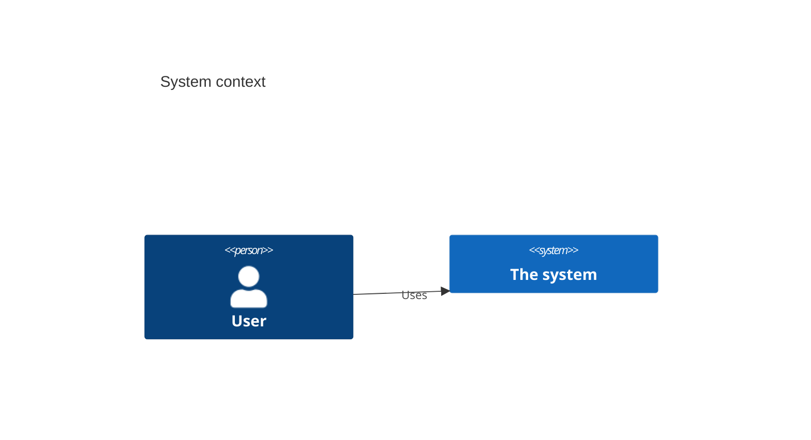

<!--
═══════════════════════════════════════════════════════════════════
ARCHITECTURE TEMPLATE -- docs/product/architecture.md   (make-arch)

ONE FILE, ONE TRUTH. The YAML frontmatter is the machine-readable
contract (context, components, integrations, diagrams) -- it is what
the validator parses, what the fingerprint hashes (A-007), and what
make-trace / make-api-contracts consume. The body below is the human
narrative plus the MERMAID diagrams. There is NO derived arch-data.yaml
-- the bytes you review and sign ARE the bytes the pipeline trusts.

It is deliberately SHORT -- the durable decisions live in the
append-only ADR log (decisions/ADR-NNNN-*.md, each carrying its own
frontmatter record), and the per-feature WHAT lives in the feature
specs. This file is the map; the ADRs are the law.

RECOMMEND-THEN-REFINE. make-arch proposes a stack, but every choice
carries a TYPED confidence:
  - known      -- backed by a stated requirement, constraint, or client
                  fact (cite it).
  - assumption -- the agent's sensible default, pending human
                  confirmation. Surfaced with a badge so a human can
                  architect against it deliberately.

meta.fingerprint and meta.arch_version are STAMPED by
scripts/stamp_fingerprint.py -- leave them blank when authoring, never
hand-edit. Strip HTML comments before publishing. Never an em dash;
use ` -- `.
═══════════════════════════════════════════════════════════════════
-->

---
meta:
  doc_type: spec-arch
  schema_version: "2.0"
  project_id: ""            # e.g. proj-2026-014
  project_name: ""
  status: draft             # draft | review | approved
  arch_version: ""          # STAMPED -- first 12 hex of the fingerprint
  fingerprint: ""           # STAMPED -- sha256 over contract content
context: ""                 # one paragraph: what the system is, who/what it talks to
components:
  - id: "C-001"             # C4 containers/components
    name: ""
    responsibility: ""
    tech: ""
    confidence: assumption  # known | assumption
    governed_by: []         # ADR ids that decide this component's technology
integrations:
  - name: ""                # external systems (the C4 context edges)
    external_system: ""
    direction: outbound     # inbound | outbound | bidirectional
    data: ""
    confidence: assumption
    governed_by: []
diagrams:
  - context                 # the body must carry a ```mermaid block per kind (A-006)
---

# Architecture -- [Project Name]

## System context

<!-- One paragraph mirroring the frontmatter `context`, then the C4
level-1 context diagram (see references/diagrams.md). The validator
(A-006) requires a ```mermaid block here for every kind listed in the
frontmatter `diagrams`. -->



## Components

<!-- The narrative view of the frontmatter `components`. One bullet
each: name, responsibility, technology, and a confidence note. Mark
assumption-backed choices with a badge so they are obvious. Link the
governing ADR. -->

- **[Component]** ([tech]) -- [responsibility]. _Confidence: known (per CON-xx)._
- **[Component]** ([tech]) -- [responsibility]. _Confidence: **assumption** -- needs confirmation._

## Integrations

<!-- The narrative view of the frontmatter `integrations`. -->

| System | Direction | Data | Confidence | Governed by |
|---|---|---|---|---|
| | inbound/outbound | | known/assumption | ADR-NNNN |

## Decisions

<!-- A short index pointing at the ADR log. Do NOT restate the decisions
here -- name them and link. The machine record is each ADR's own
frontmatter; the full Status/Context/Decision/Consequences prose lives
in decisions/ADR-NNNN-<slug>.md. -->

| ADR | Decision | Status | Confidence |
|---|---|---|---|
| ADR-0001 | | accepted | known |

<!--
═══════════════════════════════════════════════════════════════════
CHECKLIST -- strip before publishing
□ A ```mermaid context diagram is present (A-006)
□ Every component / integration / ADR has a typed confidence (A-005)
□ Assumption-backed choices carry a visible badge
□ Every accepted feature-scoped ADR is referenced by a feature (A-004)
□ Frontmatter stamped (scripts/stamp_fingerprint.py), validator passes
═══════════════════════════════════════════════════════════════════
-->
