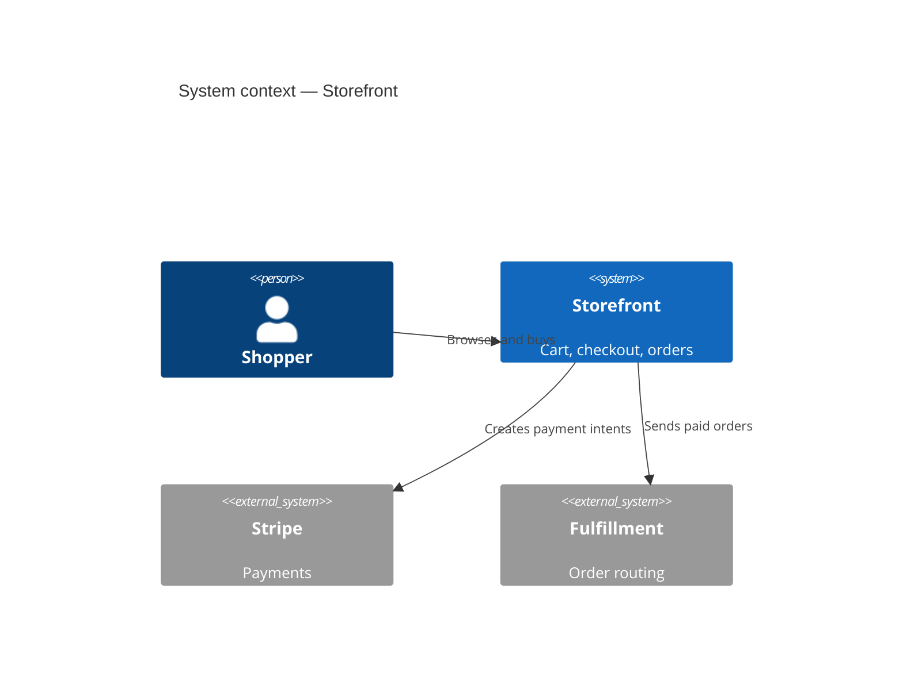
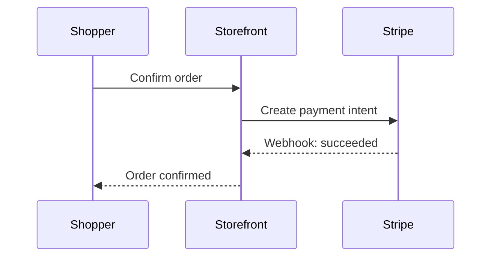
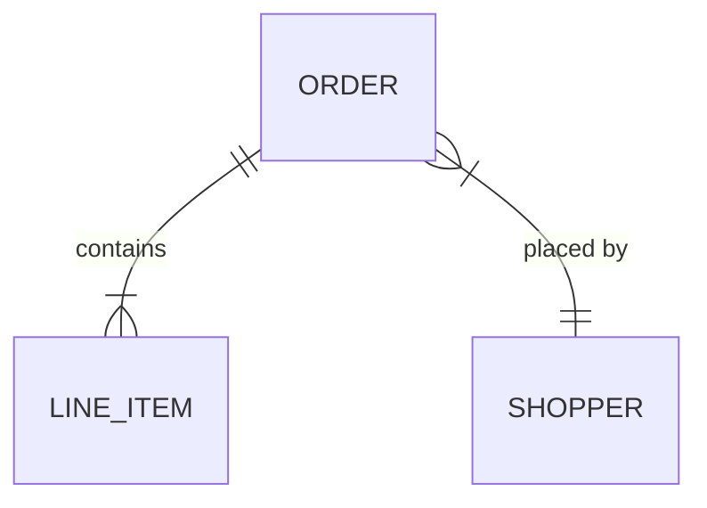

# Diagrams (mermaid)

The architecture overview is a **map**, and a map needs pictures. `architecture.md`
must carry at least a system-context diagram; add container, sequence, and ERD
diagrams where they make the system legible. All diagrams are **mermaid** fenced
blocks (` ```mermaid `), so they render in GitHub and the Claude apps and live in
the same file as the prose. The validator (A-006) checks that every kind listed in
`arch-data.yaml`'s `diagrams` has a matching mermaid block.

Keep diagrams thin -- they illustrate the decisions, they do not replace the ADRs.

## Context (required) — C4 level 1

Who/what uses the system and what it talks to. Use `C4Context`.



## Container (optional) — C4 level 2

The deployable/runnable pieces and how they communicate. Use `C4Container`.

## Sequence (optional) — a key workflow

A single important flow (checkout, auth) as a `sequenceDiagram`. One per
genuinely tricky interaction; do not diagram the trivial ones.



## ERD (optional) — the data model

The core entities and relations as an `erDiagram`, when the data shape is
non-obvious.



## Matching the index

The kinds you draw must match `arch-data.yaml`'s `diagrams` list. The validator
greps for the signature of each listed kind (`erdiagram`, `sequencediagram`, the
kind keyword for context/container). If you list `sequence` but draw none, A-006
fails -- list only what you actually drew, and always include `context`.
