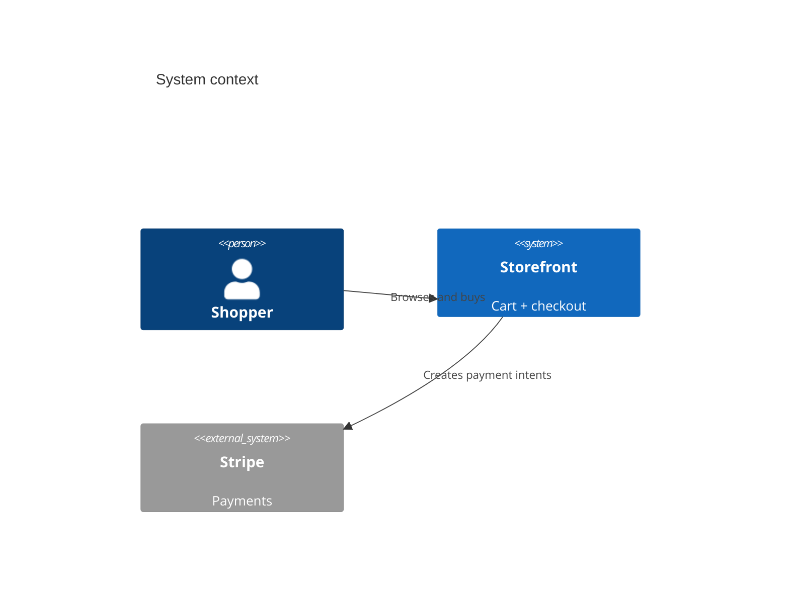

# Architecture -- Fixture Storefront

A storefront where shoppers build a cart and pay; orders sync to fulfillment.

## System context

## Components

- **Storefront web app** (Next.js) -- catalog, cart, checkout. _Confidence: known._
- **Orders service** (Node + Postgres) -- orders + fulfillment sync. _Confidence: **assumption** (pending confirmation)._

## Decisions

See `decisions/` for the full ADR log. Accepted: ADR-0001 (Stripe), ADR-0003
(hosted checkout). ADR-0002 was superseded by ADR-0003.
