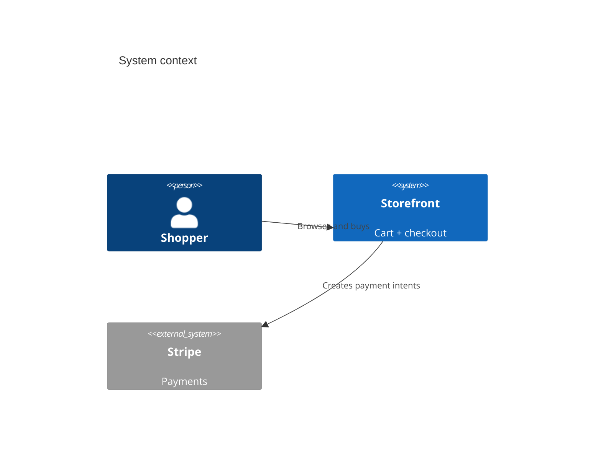

---
meta:
  doc_type: spec-arch
  schema_version: '2.0'
  project_id: proj-fixture
  project_name: Fixture Storefront
  status: draft
  arch_version: 6260835a2c5a
  fingerprint: 6260835a2c5a41fb00e3166c918579ae41d36ffe5c178cd1e7df6eb1cfd21123
context: A storefront where shoppers build a cart and pay; orders sync to fulfillment.
components:
- id: C-001
  name: Storefront web app
  responsibility: Render the catalog, cart, and checkout.
  tech: Next.js
  confidence: known
  governed_by:
  - ADR-0001
- id: C-002
  name: Orders service
  responsibility: Turn paid carts into orders and sync fulfillment.
  tech: Node + Postgres
  confidence: assumption
  governed_by:
  - ADR-0003
integrations:
- name: Payment gateway
  external_system: Stripe
  direction: outbound
  data: payment intents, webhooks
  confidence: known
  governed_by:
  - ADR-0001
diagrams:
- context
---

# Architecture -- Fixture Storefront

A storefront where shoppers build a cart and pay; orders sync to fulfillment.

## System context

## Components

- **Storefront web app** (Next.js) -- catalog, cart, checkout. _Confidence: known._
- **Orders service** (Node + Postgres) -- orders + fulfillment sync. _Confidence: **assumption** (pending confirmation)._

## Decisions

See `decisions/` for the full ADR log. Accepted: ADR-0001 (Stripe), ADR-0003
(hosted checkout), ADR-0004 (Vercel). ADR-0002 was superseded by ADR-0003.
