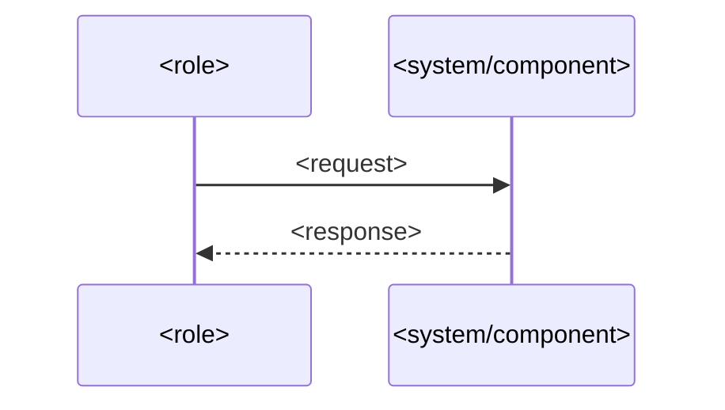
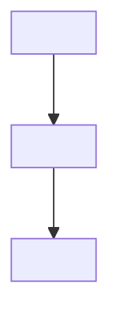

<!--
═══════════════════════════════════════════════════════════════════
FLOW REGION TEMPLATE -- the make-data-flows:flows managed region
(embedded in docs/product/features/<slug>.md, in the BODY)

This is the ONE region make-data-flows owns. It is written by
scripts/embed_flows.py, never by hand. It lives in the body, so it is
OUT of make-spec's fingerprint (which hashes only the frontmatter) --
embedding it can never move the feature version or trip S-006.

Everything OUTSIDE this region (the human narrative) is preserved
byte-for-byte on every re-embed. If a human edits the markers, the
embed aborts rather than risk clobbering the narrative.

Never an em dash; use ` -- `.
═══════════════════════════════════════════════════════════════════
-->

<!-- make-data-flows:flows -->
<!-- make-data-flows:stamp
schema_version: "1.0"
feature_version: <the make-spec feature_version these flows were generated from>
generated_at: <ISO-8601; reused on a no-op so an unchanged re-run is byte-identical>
flow_count: <number of flow blocks below>
-->
<!-- make-data-flows:flow id=DF-<PREFIX>-NN kind=data covers=FR-<PREFIX>-NNN,IR-<PREFIX>-NNN -->
_<optional one-line title>_

<!-- /make-data-flows:flow -->
<!-- make-data-flows:flow id=UF-<PREFIX>-NN kind=user covers=FR-<PREFIX>-NNN -->

<!-- /make-data-flows:flow -->
<!-- /make-data-flows:flows -->

<!--
GRAMMAR
- Outer region: exactly one per feature, bounded by
  `<!-- make-data-flows:flows -->` ... `<!-- /make-data-flows:flows -->`.
- Stamp: a single HTML comment holding YAML; the keys are fixed
  (schema_version, feature_version, generated_at, flow_count).
- Flow block: `<!-- make-data-flows:flow id=.. kind=.. covers=.. -->`
  ... a ```mermaid fenced block ... `<!-- /make-data-flows:flow -->`.
  Attributes are whitespace-delimited key=value (values carry no
  spaces; `covers` is comma-separated). An optional `_title_` line may
  precede the mermaid.
- Flow ids: DF-<PREFIX>-NN for a DATA flow, UF-<PREFIX>-NN for a USER
  flow, where <PREFIX> is the feature's requirement prefix (e.g. CHK).
- `covers` lists the requirement id(s) the flow visualizes -- the
  traceability link, and what make-api-contracts reads to know which
  calls a feature makes.
-->
