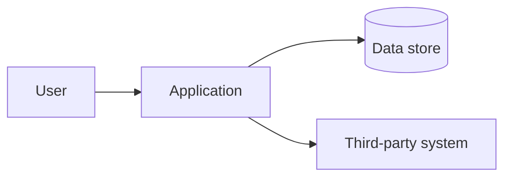
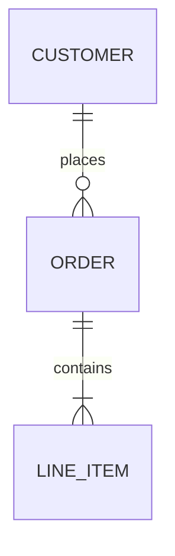
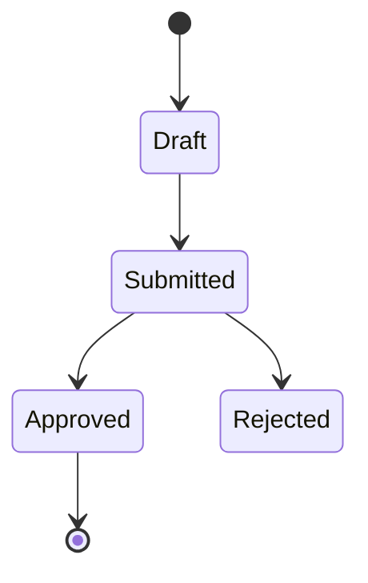
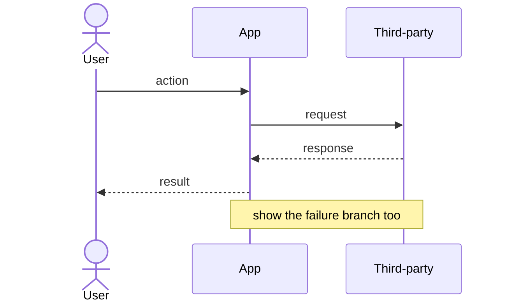

<!--
═══════════════════════════════════════════════════════════════════
MASTER TDD TEMPLATE — v1.0
Mondo Robot / RFEF Lane 3 (Solution Modeling)

HOW THIS TEMPLATE WORKS
- This file is both a human template and the instruction set for the
  TDD-generation Skill. Everything inside HTML comments is guidance
  for the author (human or AI) and MUST be stripped from the final TDD.
- The TDD answers HOW we will build what the PRD specified. The PRD
  owns WHAT and WHY; this document owns system structure, data, stack
  and vendor choices, and the rationale behind them. If you find
  yourself restating a requirement or an objective, link the PRD ID
  instead — do not re-decide the WHAT here.
- The seam runs the other way too. An item the PRD flagged "for the
  TDD" gets resolved here. A binding fact of the client's world (a
  platform mandate, a license limit) is a constraint, not a decision.
- Every entity, workflow, decision, constraint, NFR, assumption, and
  risk gets a stable ID. IDs are never reused or renumbered, even when
  items are cut. Cut items get status: superseded or deferred.
  Downstream (Lane 4 ticket generation) references these IDs, so
  breaking them breaks traceability.
- Every design element traces back. Each capability satisfies a PRD
  requirement ID; each decision and NFR derives from a requirement or
  a recorded assumption. No orphan architecture: if a piece of the
  design answers no requirement and no assumption, question why it is
  here.

RECOMMEND, THEN REFINE
- This document is built by taking a position, not by interrogating
  the engineer from a blank page. Recommendations are chosen and
  labeled known-backed or assumption-backed; assumptions are uncertain
  and owned; binding constraints are non-negotiable and confirmed.
  Proceed on clearly labeled assumptions when an answer is not
  available. Never invent certainty.

THE TDD IS A LIVING DOCUMENT
- The TDD changes over the life of the project, but only through the
  Change Management protocol in Section 1. Edits outside that protocol
  don't count and won't propagate.
- Versioning is major.minor. Minor = additive or clarifying (a new
  entity within the modeled system, an OQ resolved, a diagram added).
  Major = the meaning of an existing decision, contract, model, or
  binding constraint changed.
- Version starts at 0.1, status: draft. Only a human moves status to
  approved — that approval is the architecture-review gate. The Skill
  never self-approves.

TWO FILES, ONE TRUTH
- This Markdown file is authored by humans (and the Skill) and is the
  document people read, review, and sign.
- The Skill derives a companion machine file, tdd-data.yaml, from this
  document on every version bump. The YAML is generated, never
  hand-edited. Its `tdd_version` must match this file's frontmatter
  exactly; the validator fails the build if they drift, if any ID is
  malformed/duplicated, if a reference points at an ID that doesn't
  exist, or if a PRD requirement is left unmapped.

SYSTEM OF RECORD (see Section 1.4)
- The PRD and TDD are often drafted in a Claude Project before a repo
  exists, then pulled into the repo for the build. Two editable copies
  can drift. `system_of_record` declares which copy is canonical; the
  Skill checks it on every run and refuses to edit a non-canonical
  copy. The Skill cannot lock the other copy — the last mile is team
  discipline.

ID PREFIXES
  ENT-  Entity (data model)        WF-   Workflow / process flow
  STM-  State machine              INTG- Integration / API contract
  ADR-  Decision (lightweight ADR) BC-   Binding constraint
  TNF-  Non-functional (design)    ASM-  Assumption
  RISK- Risk                       OQ-   Open question
  (PRD IDs — FR-, NFR-, CON-, etc. — are referenced, never minted here.)
═══════════════════════════════════════════════════════════════════
-->

---
# Machine-readable document metadata. Keep this block valid YAML.
doc_type: TDD
project_id: ""            # e.g. proj-2026-014
project_name: ""
client: ""
version: "0.1"            # major.minor — see Change Management (1.2)
supersedes: ""            # previous version, e.g. "1.3"
status: draft             # draft | review | approved | superseded
last_updated: ""          # YYYY-MM-DD
authors: []
prd_version: ""           # LOCK: the latest PRD version this TDD was derived
                          # from, e.g. "2.0". The PRD may have jumped several
                          # versions before the TDD existed -- lock to whatever
                          # the latest is. If the PRD later bumps past this, the
                          # TDD is out of date and /make-tdd must be re-run.
data_file: ""             # path to derived tdd-data.yaml (generated,
                          # never hand-edited; version must match)
# --- System of record & location (see Section 1.4) ---
system_of_record: claude-project   # claude-project | git
repo:                     # null/blank until the promotion event
  url: ""                 # e.g. git@github.com:org/project.git
  path: ""                # path to this TDD.md within the repo
promoted_at: ""           # YYYY-MM-DD, set at promotion; blank in a Project
fingerprint: ""           # sha256 over the normalized tdd-data.yaml; mirrors
                          # meta.fingerprint, regenerated on save, used for
                          # drift detection
related_docs:
  prd: ""                 # link or path to the PRD (its source of truth)
  brief: ""               # link or path to the Brief, if useful
source_corpus: []         # system docs this TDD was built from, e.g.
                          # "existing-erd.png", "shopify-admin-api-v2.md"
approvals: []             # filled at sign-off: name, role, date
---

# [Project Name] — Technical Design Document

## 1. Document Control & Change Management

### 1.1 Version History

| Version | Date | Author | Class | Changed IDs | Summary | Triggered by |
|---|---|---|---|---|---|---|
| 0.1 | | | — | — | Initial draft | PRD v[X] + system context |

<!-- "Triggered by" names the origin of the change: a PRD amendment,
a build blocker, a vendor change, a discovery. Every row after
approval should trace to something concrete. -->

**Approval required from:** <!-- Names + roles. The architecture-review gate. -->

**Locked to PRD version:** <!-- The exact PRD version this TDD is derived from and locked to (matches frontmatter prd_version). If the PRD is still draft, say so and flag the rework risk. If the live PRD is newer than this, the TDD is out of date -- re-run /make-tdd. -->

### 1.2 Change Classes

<!-- The TDD is living, but changes only land through this protocol.
The test: does the change alter any ID'd item in this document? -->

| Class | What it covers | Version bump | Downstream effect |
|---|---|---|---|
| Refinement | Implementation nuance that alters no ID'd item here | none | Update the ticket only |
| Minor amendment | Additive or clarifying: new entity within the modeled system, an OQ resolved, a diagram added, wording clarified without changing meaning | minor (x.Y) | Regenerate tdd-data.yaml; new tickets if needed; existing tickets untouched |
| Major amendment | Meaning of an existing decision, contract, model, or binding constraint changes; anything cut | major (X.0) | Requires approval → ticket re-evaluation |

### 1.3 Propagation on a Major Amendment

<!-- Order matters; skipping steps is how the design and the tickets
drift apart. -->

1. The trigger (PRD amendment, build blocker, vendor change) is written up against the affected IDs and logged.
2. TDD amended; version bumps major; changed IDs recorded in 1.1; approval obtained.
3. tdd-data.yaml regenerated; validator confirms version + ID integrity (`--prev` enforces no vanished IDs); fingerprint regenerated.
4. All tickets referencing a changed ID are re-evaluated: updated, closed as superseded, or replaced. Every ticket carries the TDD version it was generated against, so the affected set is a query, not a hunt.

### 1.4 System of Record & Location

<!--
Records which copy of this TDD is canonical and where it lives. The
Skill reads this on every run and reconciles it against where it is
actually running (a Claude Project vs. a git repo):
- claude-project + in the Project        → edit normally
- claude-project + now inside a repo      → PROMOTION: flip to git, set
  repo + promoted_at, regenerate fingerprint, mark the Project copy
  SUPERSEDED
- git + in the repo                        → edit normally
- git + in the Project / outside the repo  → STOP; the canonical copy is
  in the repo; amend there via /make-tdd

Honest limit: the Skill cannot lock the other copy. It declares,
checks, warns, stamps, and fingerprints. The last mile is discipline.
-->

| Field | Value |
|---|---|
| System of record | <!-- claude-project | git --> |
| Repo (if promoted) | <!-- url + path to TDD.md --> |
| Promoted at | <!-- YYYY-MM-DD, blank until promotion --> |

---

## 2. Summary

<!--
One page max. Write this LAST. A reader who sees nothing else should
walk away knowing: the shape of the system, the two or three load-
bearing decisions, and the biggest open risks. Plain words, no
marketing language.
-->

**The system in a paragraph:**

**Load-bearing decisions:** <!-- The 2-3 ADR- choices everything else hangs on -->

**Biggest open items:** <!-- Top risks/open questions from Sections 11/13, by impact -->

---

## 3. System Overview

<!--
The system in one diagram and a few paragraphs. Show the major
components, the boundaries (what we build vs. what we integrate with),
and the request/data flow at a high level. Detail lives in later
sections; this is the map.
-->

**Major components:** <!-- One line each: responsibility + what it owns -->

**Boundaries:** <!-- What we build vs. integrate; the trust boundaries -->

---

## 4. Data Models

<!--
The entities the system owns, their attributes, and relationships.
One ERD for the whole model, then one block per entity. Each entity
states the PRD requirement IDs it satisfies — that is its reason to
exist. An entity that satisfies nothing is either missing its trace or
should not be here.
-->

<!-- Repeat this block per entity. -->

#### ENT-001 — [Entity name]
- **Purpose:** <!-- What it represents, one line -->
- **Key attributes:** <!-- name : type — note. Mark identifiers and required fields -->
- **Relationships:** <!-- to other ENT- ids, with cardinality -->
- **Satisfies:** <!-- FR-xxx, IR-xxx — the PRD requirements this entity serves -->
- **Notes / open items:** <!-- link OQ- ids if unresolved -->

---

## 5. Behavioral Models

<!--
State machines for any stateful object — an order, a submission, a
subscription. If an entity moves through states with rules about which
transitions are legal, model it here. Skip for stateless systems.
Each state machine names the entity it governs and the requirements it
satisfies.
-->

<!-- Repeat per stateful object. -->

#### STM-001 — [Object] lifecycle
- **Governs entity:** <!-- ENT-xxx -->
- **Satisfies:** <!-- FR-xxx -->

---

## 6. Process Flows

<!--
Sequence diagrams for the key workflows — the journeys from the PRD's
Section 5 rendered as system interactions. Show the actors and
components, the order of calls, and the failure branches (a flow that
only shows the happy path is not done). Each flow satisfies one or
more PRD requirements.
-->

<!-- Repeat per workflow. -->

#### WF-001 — [Workflow name]
- **Satisfies:** <!-- FR-xxx, UO-xxx -->
- **Trigger:** <!-- what starts it -->

---

## 7. Integrations & API Contracts

<!--
Every third-party system the design depends on, and the contract with
it: auth model, the endpoints/events used, data exchanged, rate limits
and quotas, and error/retry behavior. "Orders sync to NetSuite" was
the PRD requirement; the token model, the endpoint, and the 5-req/sec
limit are the TDD contract. Any limit that bounds the design is a
binding constraint (Section 8) — reference it here.
-->

<!-- Repeat per integration. -->

#### INTG-001 — [System name]
- **Direction:** <!-- inbound / outbound / bidirectional -->
- **Auth model:** <!-- OAuth2 client-credentials, API key, signed webhook... -->
- **Endpoints / events:** <!-- the specific calls or events used -->
- **Data exchanged:** <!-- entities/fields, which ENT- ids -->
- **Limits & SLAs:** <!-- rate limits, quotas, latency targets -->
- **Error / retry behavior:** <!-- timeouts, idempotency, backoff -->
- **Satisfies:** <!-- IR-xxx, FR-xxx -->
- **Bounded by:** <!-- BC-xxx if a binding constraint applies -->

---

## 8. Binding Constraints

<!--
The must-be-true conditions the design is bound by — version
requirements, licensing restrictions, platform and runtime mandates,
compliance-driven technical requirements. These are confirmed, not
debated: the engineer verifies them and the design respects them.
Each has a SOURCE: a PRD constraint ID (CON-xxx), a license, a vendor,
a platform, or a compliance regime. A constraint with no source is a
preference in disguise — promote it to a decision (Section 10) or cut
it.
-->

| ID | Constraint | Source | Implication for the design |
|---|---|---|---|
| BC-001 | <!-- e.g. Must run on the client's Shopify Plus tenant --> | <!-- CON-003 / license / vendor / platform / compliance --> | <!-- what it forces --> |

---

## 9. Non-Functional Requirements

<!--
Performance, security, scalability, accessibility, observability. Each
NFR DERIVES FROM a PRD requirement or a recorded assumption — say which
— and each has a testing method or it is a wish. Defaults
(accessibility, security, observability) stay in unless explicitly
waived; record any waiver in the changelog.
-->

| ID | Category | Requirement | Derived from | Testing method |
|---|---|---|---|---|
| TNF-001 | Accessibility | <!-- e.g. WCAG 2.2 AA across the app --> | NFR-001 | Automated + manual screen-reader pass |
| TNF-002 | Performance | <!-- e.g. p75 API latency < 300ms --> | NFR-002 / ASM-xxx | Load test in staging |
| TNF-003 | Security | <!-- e.g. secrets in vault, no PII in logs --> | NFR-003 | Security review + log audit |

---

## 10. Technology & Vendor Decisions

<!--
The HOW choices, as lightweight ADRs. One block per decision. State
the decision, why, what you considered and rejected, the requirement
or assumption it serves, and any binding constraint it lives within.
Tag each as known-backed (the inputs settle it) or assumption-backed
(it rests on something unconfirmed). Every decision must serve at least
one requirement or assumption — no orphan choices.
-->

<!-- Repeat per decision. -->

#### ADR-001 — [Decision title]
- **Status:** <!-- proposed / accepted / superseded -->
- **Backing:** <!-- known-backed | assumption-backed -->
- **Decision:** <!-- what we will do -->
- **Rationale:** <!-- why, in plain words -->
- **Alternatives considered:** <!-- options + why rejected -->
- **Derived from:** <!-- FR-xxx / NFR-xxx / ASM-xxx — what it serves -->
- **Bounded by:** <!-- BC-xxx, or "none" -->

---

## 11. Assumptions & Risks

### 11.1 Assumptions

<!-- Things the design treats as true without confirmation. Each has an
owner who can confirm or refute it, and a status. An assumption nobody
owns is a risk in disguise. Unresolved blocking assumptions block
approved status. -->

| ID | Assumption | Impact if wrong | Owner | Status |
|---|---|---|---|---|
| ASM-001 | | <!-- what breaks --> | | open / confirmed / refuted |

### 11.2 Risks

<!-- Technical risks with a mitigation, not a vibe. Severity drives the
approval gate: an open high-severity risk blocks approved status. -->

| ID | Risk | Severity | Mitigation | Owner | Status |
|---|---|---|---|---|---|
| RISK-001 | | low / med / high | | | open / mitigated / accepted |

---

## 12. Traceability & Gap Analysis

<!--
The proof that the design covers the spec. One row per PRD must/should
requirement, mapped to the capability (ENT-/WF-/STM-/INTG-/TNF-/ADR-)
that satisfies it. Then an explicit list of anything UNMAPPED — a
requirement with no design answer yet. An empty Unmapped list at
approval is the goal; a populated one in a draft is honest.
-->

| PRD requirement | Satisfied by | Notes |
|---|---|---|
| FR-001 | ENT-001, WF-002 | |
| FR-002 | INTG-001 | |

**Unmapped requirements:** <!-- PRD must/should IDs with no satisfying capability yet, each linked to the OQ- that tracks it. "none" only when truly none. -->

---

## 13. Open Questions

<!--
Decisions deferred, with an owner and what they block. The Skill routes
anything it cannot decide or assume here. This section being long in
v0.1 is healthy; it being long at approval is not.
-->

| ID | Question | Blocks (what design element) | Owner | Status |
|---|---|---|---|---|
| OQ-001 | | | | open |

---

## Appendix A: Source Index

<!--
Inventory of every system input read while designing — existing ERDs,
ADRs, API docs, brand/tech standards — with a short handle used in
citations. Distinct from the PRD itself (named in frontmatter
related_docs.prd).
-->

| Handle | Document | Type | Date |
|---|---|---|---|
| DOC-1 | shopify-admin-api-2026-02.md | api-doc | 2026-02-01 |

<!--
═══════════════════════════════════════════════════════════════════
AUTHOR / SKILL CHECKLIST — strip before publishing
□ Every PRD must/should requirement is mapped in Section 12, or listed
  as Unmapped with an OQ- tracking it
□ Every entity/workflow/decision/NFR traces to a requirement or assumption
□ Every diagrammed element has a Mermaid block
□ Every binding constraint has a source
□ Every decision states alternatives considered and what it serves
□ Every assumption and risk has an owner and a status
□ No open high-severity risk or unresolved blocking assumption if status: approved
□ System of record (1.4) set; promotion handled if this entered a repo
□ tdd-data.yaml regenerated; validator passes; versions match; fingerprint set
□ Version history row complete: class, changed IDs, trigger
□ All guidance comments removed from the published version
═══════════════════════════════════════════════════════════════════
-->
