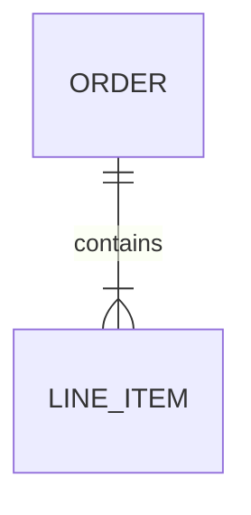
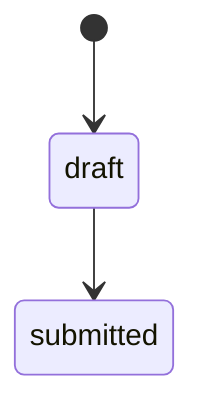
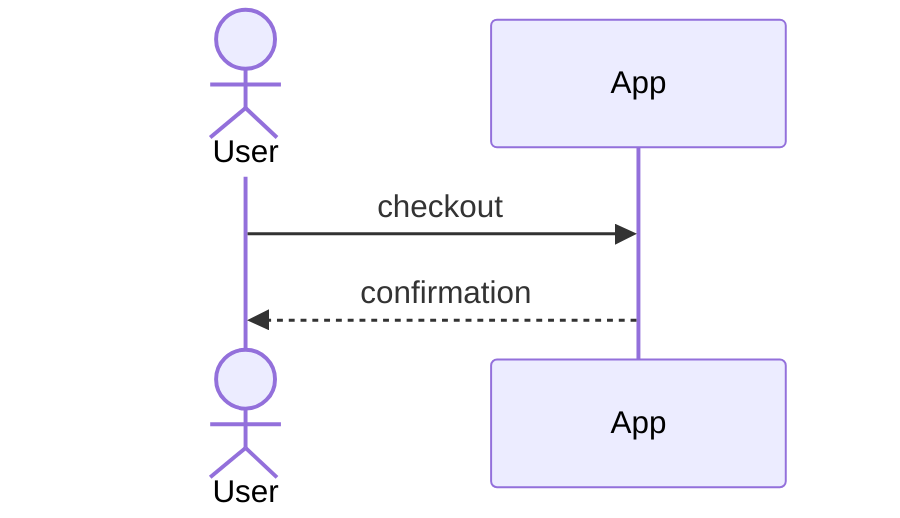

# Test Project — Technical Design Document

## 4. Data Models

#### ENT-001 — Order
- Purpose: a customer order.

## 5. Behavioral Models

#### STM-001 — Order lifecycle

## 6. Process Flows

#### WF-001 — Checkout

